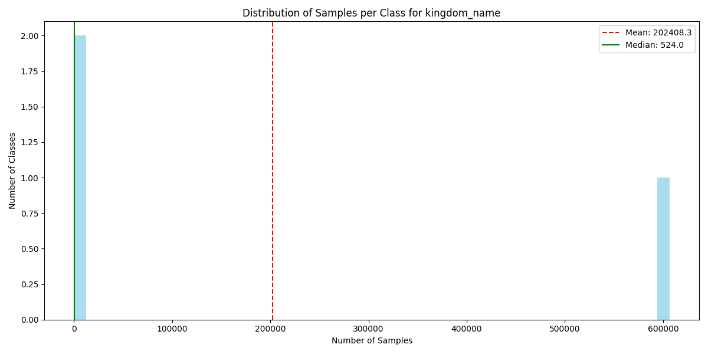
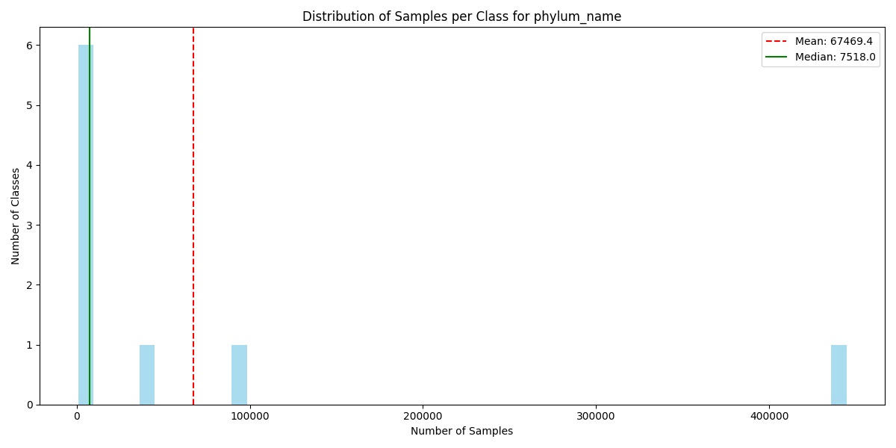
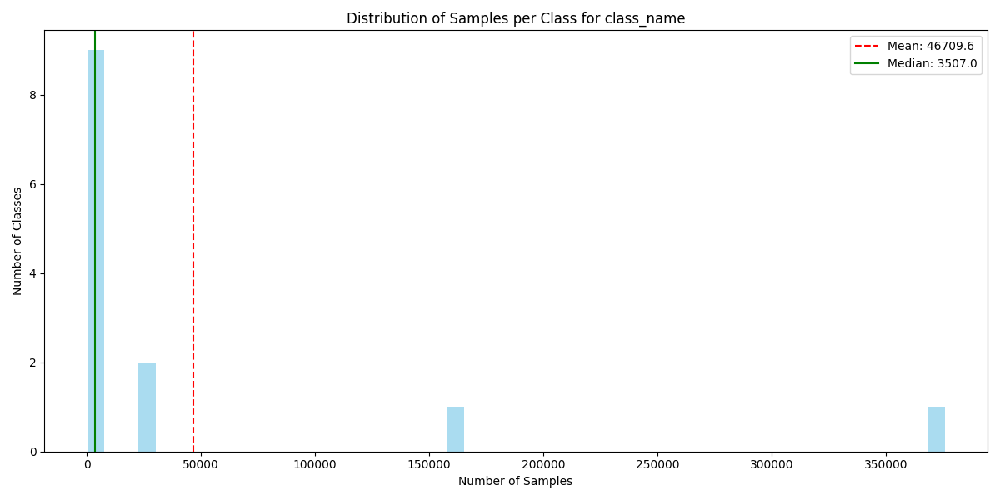
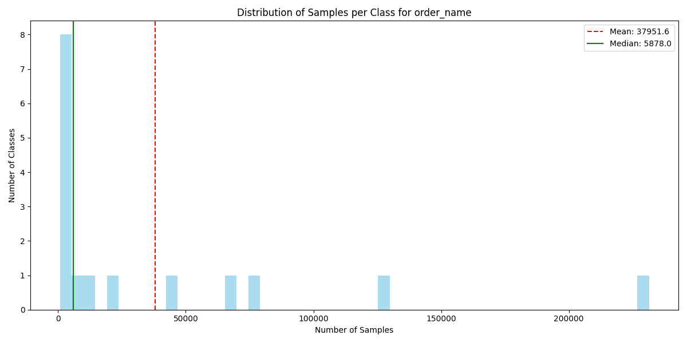

# Taxonomic Class Distribution Analysis

Dataset: `data/dataset.csv`  
Total samples: 607225  
Analysis date: 2025-06-16 20:28:18  

## Summary

| Taxonomic Rank | Unique Classes | Min Samples | Max Samples | Mean Samples | Median Samples |
|---------------|---------------|-------------|-------------|--------------|---------------|
| kingdom_name | 3 | 326 | 606375 | 202408.3 | 524.0 |

## Kingdom Distribution

- **Total classes**: 3
- **Missing values**: 0 (0.0%)
- **Samples per class**: Min=326, Max=606375, Mean=202408.3, Median=524.0

### Most Common Classes

| Class | Samples | Percentage |
|-------|---------|------------|
| Metazoa | 606375 | 99.86% |
| Viridiplantae | 524 | 0.09% |
| Fungi | 326 | 0.05% |

### Least Common Classes

| Class | Samples | Percentage |
|-------|---------|------------|
| Metazoa | 606375 | 99.86% |
| Viridiplantae | 524 | 0.09% |
| Fungi | 326 | 0.05% |

Complete distribution saved to: [`kingdom_name_distribution.csv`](class_distributions/kingdom_name_distribution.csv)

| phylum_name | 9 | 850 | 444542 | 67469.4 | 7518.0 |

## Phylum Distribution

- **Total classes**: 9
- **Missing values**: 0 (0.0%)
- **Samples per class**: Min=850, Max=444542, Mean=67469.4, Median=7518.0

### Most Common Classes

| Class | Samples | Percentage |
|-------|---------|------------|
| Arthropoda | 444542 | 73.21% |
| Chordata | 97151 | 16.00% |
| Mollusca | 36381 | 5.99% |
| Other_metazoa | 8929 | 1.47% |
| Annelida | 7518 | 1.24% |
| Echinodermata | 6394 | 1.05% |
| Platyhelminthes | 2814 | 0.46% |
| Cnidaria | 2646 | 0.44% |
| No_metazoa | 850 | 0.14% |

### Least Common Classes

| Class | Samples | Percentage |
|-------|---------|------------|
| Arthropoda | 444542 | 73.21% |
| Chordata | 97151 | 16.00% |
| Mollusca | 36381 | 5.99% |
| Other_metazoa | 8929 | 1.47% |
| Annelida | 7518 | 1.24% |
| Echinodermata | 6394 | 1.05% |
| Platyhelminthes | 2814 | 0.46% |
| Cnidaria | 2646 | 0.44% |
| No_metazoa | 850 | 0.14% |

Complete distribution saved to: [`phylum_name_distribution.csv`](class_distributions/phylum_name_distribution.csv)

| class_name | 13 | 154 | 375863 | 46709.6 | 3507.0 |

## Class Distribution

- **Total classes**: 13
- **Missing values**: 0 (0.0%)
- **Samples per class**: Min=154, Max=375863, Mean=46709.6, Median=3507.0

### Most Common Classes

| Class | Samples | Percentage |
|-------|---------|------------|
| Insecta | 375863 | 61.90% |
| No_arthropoda | 162683 | 26.79% |
| Arachnida | 29225 | 4.81% |
| Malacostraca | 24442 | 4.03% |
| Hexanauplia | 3638 | 0.60% |
| Thecostraca | 3536 | 0.58% |
| Collembola | 3507 | 0.58% |
| Branchiopoda | 2058 | 0.34% |
| Chilopoda | 724 | 0.12% |
| Diplopoda | 611 | 0.10% |

### Least Common Classes

| Class | Samples | Percentage |
|-------|---------|------------|
| Malacostraca | 24442 | 4.03% |
| Hexanauplia | 3638 | 0.60% |
| Thecostraca | 3536 | 0.58% |
| Collembola | 3507 | 0.58% |
| Branchiopoda | 2058 | 0.34% |
| Chilopoda | 724 | 0.12% |
| Diplopoda | 611 | 0.10% |
| Ostracoda | 581 | 0.10% |
| Pycnogonida | 203 | 0.03% |
| Other_arthropoda | 154 | 0.03% |

Complete distribution saved to: [`class_name_distribution.csv`](class_distributions/class_name_distribution.csv)

| order_name | 16 | 709 | 231362 | 37951.6 | 5878.0 |

## Order Distribution

- **Total classes**: 16
- **Missing values**: 0 (0.0%)
- **Samples per class**: Min=709, Max=231362, Mean=37951.6, Median=5878.0

### Most Common Classes

| Class | Samples | Percentage |
|-------|---------|------------|
| No_insecta | 231362 | 38.10% |
| Lepidoptera | 128348 | 21.14% |
| Diptera | 76824 | 12.65% |
| Coleoptera | 66892 | 11.02% |
| Hymenoptera | 44235 | 7.28% |
| Hemiptera | 21265 | 3.50% |
| Trichoptera | 10195 | 1.68% |
| Orthoptera | 7069 | 1.16% |
| Odonata | 4687 | 0.77% |
| Ephemeroptera | 4563 | 0.75% |

### Least Common Classes

| Class | Samples | Percentage |
|-------|---------|------------|
| Trichoptera | 10195 | 1.68% |
| Orthoptera | 7069 | 1.16% |
| Odonata | 4687 | 0.77% |
| Ephemeroptera | 4563 | 0.75% |
| Other_insecta | 3236 | 0.53% |
| Plecoptera | 3163 | 0.52% |
| Neuroptera | 1778 | 0.29% |
| Blattodea | 1664 | 0.27% |
| Thysanoptera | 1235 | 0.20% |
| Psocoptera | 709 | 0.12% |

Complete distribution saved to: [`order_name_distribution.csv`](class_distributions/order_name_distribution.csv)

